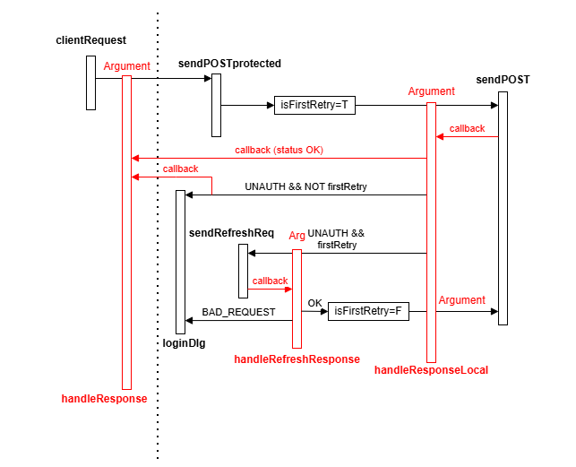

## JWT Authentication incremental build

### Table of Contents

1. [Send refresh token on Login button](#1-send-refresh-token-on-login-button)  
2. [Refresh token validation](#2-refresh-token-validation)  
3. [Upgraded Refresh token validation](#3-upgraded-refresh-token-validation)  
4. [Handle real renewed tokens](#4-handle-real-renewed-tokens)  
5. [Authorization Bearer header section with accessToken](#5-authorization-bearer-header-section-with-accesstoken)  
    - [Endpoints currently implemented on backend](#endpoints-currently-implemented-on-backend)  
    - [Happy path](#happy-path)  
    - [Invalid accessToken](#invalid-accesstoken)  
    - [Token Validation Flow](#token-validation-flow)  
6. [Invalid access token retry path for /register endpoint](#6-invalid-access-token-retry-path-for-register-endpoint)  
7. [Login with password and logout – manual and automatic](#7-login-with-password-and-logout---manual-and-automatic)


### 1. Send refresh token on Login button

- handleLoginClick 
  - get refreshToken from sessionStorage   
  - send POST request { refreshToken } to api/auth/refresh
- Response { dummyAccessToken, dummyRefreshToken }
  - save to sessionStorage 
- Handle WS message - Write to console.log

### 2. Refresh token validation 

- Response Status code 200 (OK)
  - RefreshToken in Request was valid - login successfull
- Response Status code 201 (Created)
  - RefreshToken in Request was invalid or expired - password login required
- Ony log Status code received

### 3. Upgraded Refresh token validation 

- For invalid or expired refreshToken
  - Response HttpStatus.UNAUTHORIZED (401)  
- For valid refreshToken
  - Response HttpStatus.OK (200) with { dummyAccessToken, refreshToken, userId, isOnline: true }   
- Testing on Frontend  
  1. Request { refreshToken: dummyRefreshToken }  
      - Expected Response: HttpStatus.UNAUTHORIZED (401) { error: 'Refresh token missing, invalid or expired' }
  2. Request { refreshToken: validRefreshToken }  
      - Expected Response: HttpStatus.OK (200) { dummyAccessToken, newRefreshToken, userId, isOnline: true }

Note: Status codes that never carry message body: 
- 204 (No Content)
- 205 (Reset Content)
- 304 (Not Modified)

### 4. Handle real renewed tokens

- get refreshToken from sessionStorage
- on Response OK save renewed accessToken and refreshToken to sessionStorage
- no Authorization: Bearer header with accessToken sent yet

### 5. Authorization Bearer header section with accessToken 
 
Frontend protected endpoint Request workflow   
- Frontend sends access token  
- If backend returns 200 - happy path  
- If backend returns 401 (invalid/expired access token): 
  - send refresh token 
    - receive new access + refresh tokens
      - retry request 
    - refresh failed 
      - force password login

#### Endpoints currently implemented on backend:

- api/ping  
- api/pingdb
- api/users/all
- api/users/register (protected)
- websocket
- api/auth/refresh


- Added Authorization Bearer section in header of generic send for POST and GET request:

  ```js
  fetch( postUrl, {
    method: "POST",
    headers: { 
      "Authorization": "Bearer " + sessionStorage.getItem("accessToken"),
      "Content-Type": "application/json" 
    },
    body: msgBody, 
  }) 
  ```

#### Happy path

- Sending accessToken in header of each Request
  - Response Status Code 200 (OK)
  - proceeding with business logic

#### Invalid accessToken

- backend does NOT create new tokens, only sends Response Status Code
  - 400 (Bad Request) for missing Authorization header in Request
  - 401 (Unathorized) for invalid/expired JWT
- frontend runs refresh token path providing refreshToken in Request
  - on valid Refreh token 
    - backend sends new accessToken and refreshToken in Response
    - frontend stores tokens and retries initial call to protected endpoint
  - on invalid refresh Token backend sends code 401 (Unathorized)
    - frontend runs password login path
      - on valid password 
        - backend sends new accessToken and refreshToken in Response
        - frontend stores tokens, no second retry call (overkill)


#### Token Validation Flow

1. AccessToken - no new tokens in Response
2. RefreshToken - new tokens in Response
3. Password - new tokens in Response

### 6. Invalid access token retry path for /register endpoint

- Single retry mechanism
  - Retry the protected request only once after refresh
  - If refresh fails, do not keep retrying - force login
- Centralized error handling
  - The retry logic sits in a single place
- Automatic & transparent token renewal
  - Users do not notice anything when access tokens expire
- Refresh token only used when necessary
  - Never check refresh token before each call (ruins performance)
- Clean fallback to full authentication
  - If refresh fails - raise login dialog (force login)
 
 

### 7. Login with password and logout - manual and automatic

- Added password field into LoginDialog an added password argument
- Added password param in loginUser (utils.ts)
- Updated handleUserLogin to store received tokens, userId and setCurrentUserId
- Auto login and Login button with flag parameter(showLoginDlg)
- Logout cleaning tokens and userId

### 8. Role-Based Access Control (RBAC)

#### Install JWT decoder library:

  ```ts
  npm install jwt-decode
  ```

#### Create helper file

  ```ts
  import { jwtDecode } from "jwt-decode";

  export interface DecodedToken {
    sub: string;        // username
    userId: string;
    roles?: string[];
    claims?: string[];
    exp: number;
    iat: number;
  }

  export function getDecodedToken(): DecodedToken | null {
    const token = sessionStorage.getItem("accessToken");
    if (!token) return null;
    try {
      return jwtDecode<DecodedToken>(token);
    } 
    catch (err) {
      console.error("Invalid JWT:", err);
      return null;
    }
  }
  ```

#### Show claims with user logged in

  ```ts
  {currentUserId && (
  <div>
    <div>
      Logged in as: {usersRegistered.find(u=>u.userId==currentUserId)?.fullname}
    </div>
    <div>Claims: {
      <label>  
        {currentUserClaims.join(', ')}
      </label>
    }
    </div>  
  </div> )}
  ```
